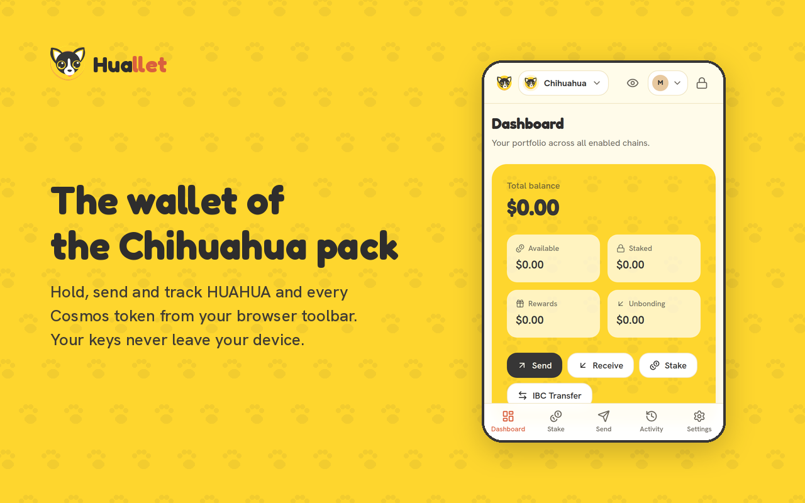
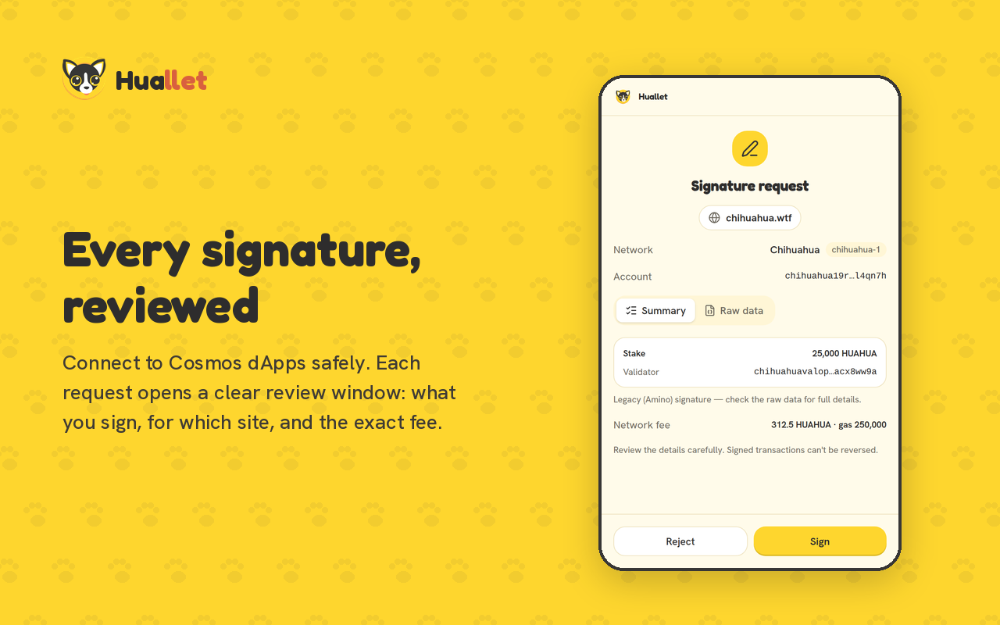
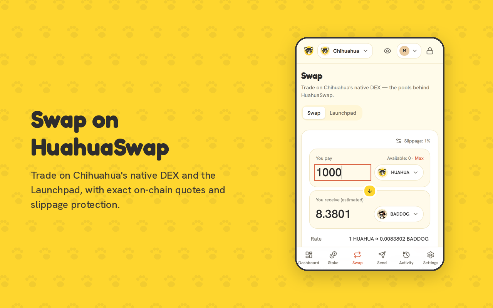
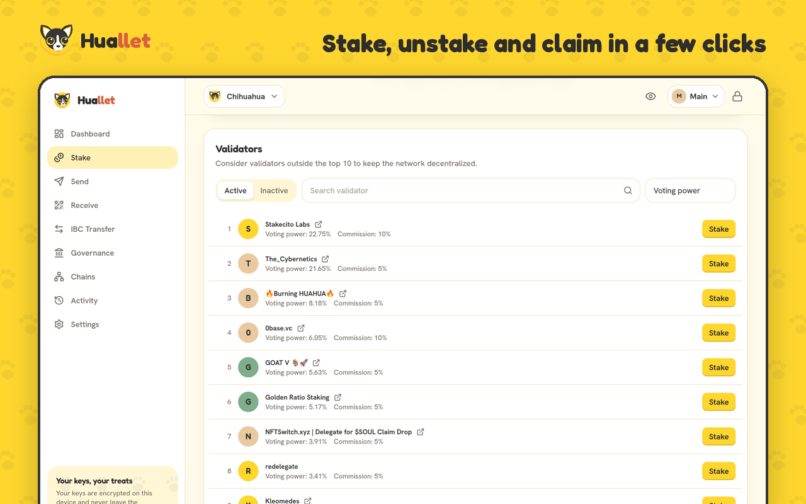
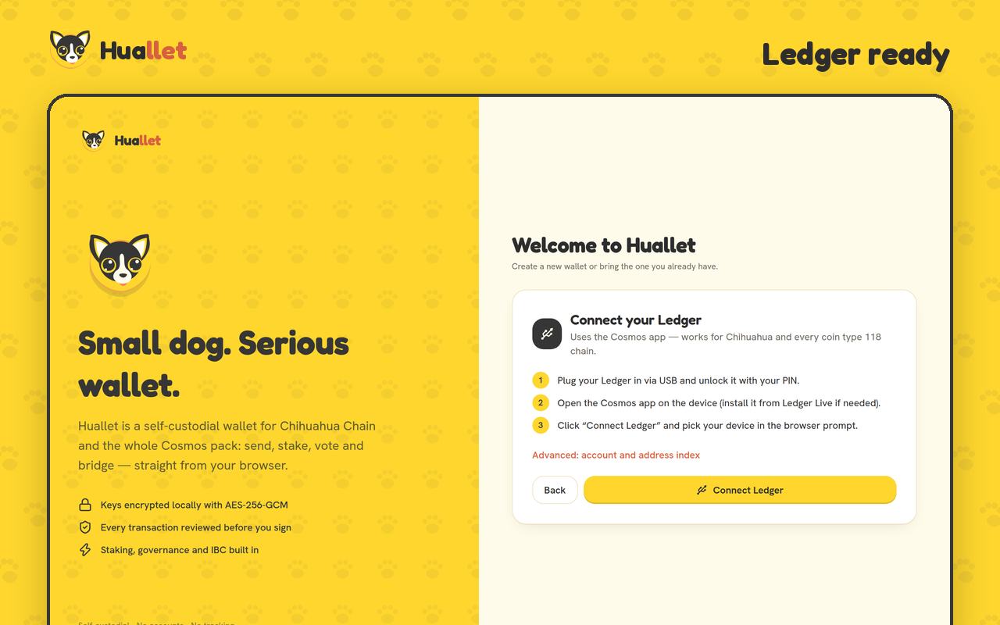
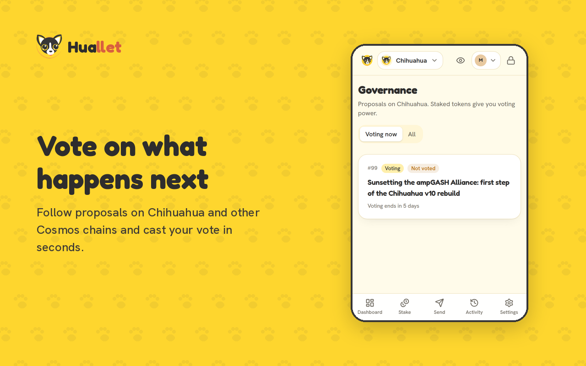

<p align="center">
  
</p>

<h1 align="center">Huallet</h1>

<p align="center">
  <b>The self-custodial wallet of Chihuahua Chain.</b><br />
  Hold, send, stake, swap and vote on HUAHUA and the whole Cosmos ecosystem — from a browser extension that keeps your keys on your device.
</p>

<p align="center">
  
  
</p>

---

## What's inside

| | |
|---|---|
| **Huallet extension** (Chrome, Brave, Edge, Firefox · Manifest V3) | The wallet: creates or imports accounts, keeps keys encrypted on the device, signs from its popup, supports Ledger and lets dApps connect through `window.huallet`. |
| **Huallet web app** | A dashboard that never holds keys: it connects to the Huallet extension (or Keplr / Leap) and every signature is approved in the wallet. |

## Features

- **Accounts** — create (12/24 words, with verification) or import a recovery phrase or private key; multiple accounts; custom derivation index; **Ledger** (Cosmos app).
- **Portfolio** — balances across chains in fiat: available, staked, rewards and unbonding; native, IBC, tokenfactory and CW20 tokens.
- **Staking** — multi-chain overview with APR; validator list with voting power and commission; stake, unstake, redelegate, claim one or all.
- **Swap on HuahuaSwap** — Chihuahua's native DEX (`x/liquidity`): quotes computed exactly like the chain, price impact, slippage limit, multi-hop through HUAHUA in one atomic transaction; **Launchpad** buy/sell on bonding curves.
- **IBC transfers** — channels from the Cosmos chain registry, verified on-chain before sending.
- **Governance** — proposals, live tally, vote.
- **Any Cosmos chain** — Chihuahua, Cosmos Hub, Osmosis, Juno and Celestia built in; add others from the chain registry, a ChainInfo JSON or a form.
- **dApp provider** — `window.huallet` with a familiar Cosmos wallet API ([integration guide](docs/DAPP_INTEGRATION.md)).

<p align="center">
  
  
  
  
</p>

## Security

Huallet is built so that a compromised website can't take your funds, and so that anyone can check what the extension does.

**Keys**
- Recovery phrases and private keys are encrypted with **AES-256-GCM**; the key is derived from your password with **PBKDF2-SHA256, 600,000 iterations** and a random salt. Parameters are stored with the vault and upgraded automatically.
- Keys exist only in the extension's **background service worker**. The popup never holds them: it sends the transaction bytes and receives a signature.
- While unlocked, decrypted keys live in `storage.session` — **memory only**, never written to disk, not readable by content scripts, wiped when the browser closes. The wallet **auto-locks** after inactivity, and wrong passwords trigger an exponential back-off.
- Revealing a secret, removing an account or changing the password always asks for the password again.
- **Ledger** accounts store only the public key. Signatures come from the device and are **cryptographically verified** by the background before being returned to a website.

**Websites and signatures**
- A site sees nothing until you approve a **connection request**; permissions are per origin and per chain, and can be revoked in *Settings → Connected sites*.
- Every signature opens a **Huallet review window** with the decoded messages, fee, memo and raw data. Closing the window rejects the request.
- The requesting origin comes from the browser, never from the page. Chain-id and signer are checked; messages Huallet can't decode are flagged.
- Only extension pages can talk to the keyring; web pages reach the background through a single provider port.

**Code and data**
- Manifest V3 CSP `script-src 'self'`: no remote code, no `eval` in application code, no analytics, no trackers.
- Untrusted data is validated: chain configs (https only), bech32 addresses (wrong-chain detection), IBC channels (verified on-chain), proposal text (rendered as plain text), unverified tokens flagged, memos that look like secrets blocked.
- Price data (CoinGecko, optional) receives token identifiers only, never your address. See [PRIVACY.md](PRIVACY.md).
- **Reproducible builds**: building the tagged source produces byte-identical extension packages.

Huallet has **not been independently audited yet**. Report vulnerabilities privately — see [SECURITY.md](SECURITY.md).

## Install

**From the stores** — Chrome Web Store and Firefox Add-ons listings are in review.

**From source** (Node.js 22):

```bash
npm ci
npm run build:ext
```

- **Chrome / Brave / Edge**: open `chrome://extensions`, enable *Developer mode*, click *Load unpacked* and select `dist-extension/chrome`.
- **Firefox ≥ 140**: open `about:debugging#/runtime/this-firefox`, *Load Temporary Add-on*, select `dist-extension/firefox/manifest.json`.

Ledger needs WebHID, available in Chromium-based browsers only.

## Connect your dApp

Huallet injects `window.huallet` on every https page. The API follows the widely used Cosmos wallet interface, so existing CosmJS code works with a one-line change:

```ts
import { SigningStargateClient } from "@cosmjs/stargate";

const wallet = window.huallet;
if (!wallet) throw new Error("Install Huallet");

await wallet.enable("chihuahua-1");                             // asks the user to connect
const signer = await wallet.getOfflineSignerAuto("chihuahua-1"); // Amino-only for Ledger accounts
const [account] = await signer.getAccounts();

const client = await SigningStargateClient.connectWithSigner("https://rpc.chihuahua.wtf", signer);
await client.sendTokens(account.address, recipient, [{ denom: "uhuahua", amount: "1000000" }], "auto");
```

React to account changes:

```ts
window.addEventListener("huallet_keystorechange", () => refreshAccount());
```

Login with a signed message (ADR-36):

```ts
const { signature, pub_key } = await window.huallet.signArbitrary("chihuahua-1", address, "Sign in to MyDapp");
```

The full API, detection helper and wallet-selection example are in **[docs/DAPP_INTEGRATION.md](docs/DAPP_INTEGRATION.md)**.

## Development

```bash
npm ci
npm run dev             # web app on http://localhost:5173
npm test                # unit tests (crypto, keyring, amounts, chain validation, DEX math and encoding)
npm run build           # web app → dist/
npm run build:ext       # extension → dist-extension/{chrome,firefox}/ and release/*.zip
npm run test:e2e        # end-to-end: extension, dApp provider, web app and Ledger flow in a throw-away Chrome profile
npm run package:source  # source archive for store review → release/
```

```
src/
  lib/            framework-agnostic logic: crypto, keyring, chains, Cosmos REST/tx, HuahuaSwap DEX, wallet adapters
  state/ hooks/   zustand stores and react-query hooks
  components/     UI kit, layout, transaction review dialog
  pages/          screens shared by the web app and the extension
  extension/      background service worker, content scripts, popup, Ledger, onboarding
scripts/          extension build, source packaging, third-party notices
e2e/              Puppeteer end-to-end tests
store/            store listings, graphics and release checklist
```

Maintainer notes:
- `@scure/base` is pinned to `2.2.0` through `overrides`: newer versions reject the `limit = Infinity` that `@cosmjs/encoding@0.39` passes to `fromBech32`. Remove the override once CosmJS is fixed and re-run the tests.
- Releasing to the stores: see [store/RELEASE.md](store/RELEASE.md).

## License

Apache License 2.0 — © 2026 The Chihuahua Chain Project. See [LICENSE](LICENSE) and [NOTICE](NOTICE).
The Chihuahua and Huallet names and logos are not covered by the license — see [TRADEMARKS.md](TRADEMARKS.md).

Huallet is self-custodial software provided "as is", without warranties. Nobody, including the Chihuahua Chain Project,
can recover your recovery phrase or reverse a transaction. Keep your recovery phrase offline and use a hardware wallet
for significant amounts.
